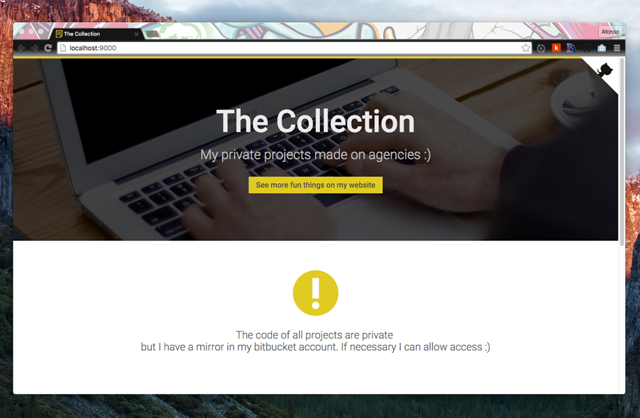

# [The Collection](http://afonsopacifer.github.io/the-collection/)

> My private projects made ​​on agencies :)

## Insert new content

1 - Edit the data.json file and add the new content.

2 - Run the grunt task for build the static pages:

`$ grunt build`

## Tasks list

- `$ grunt build`: Compile, concat and minify all files
- `$ grunt serve`: Watch the files to build and start a static server
- `$ grunt autoprefixer`: Autoprefixer the css
- `$ grunt deploy`: Deploy for gh-pages`$ grunt deploy`

## Contributing

Want to contribute? [Follow these recommendations](https://github.com/afonsopacifer/the-collection/blob/master/CONTRIBUTING.md).

## Licence

[MIT Licence](https://github.com/afonsopacifer/the-collection/blob/master/LICENCE.md) © Afonso Pacifer
